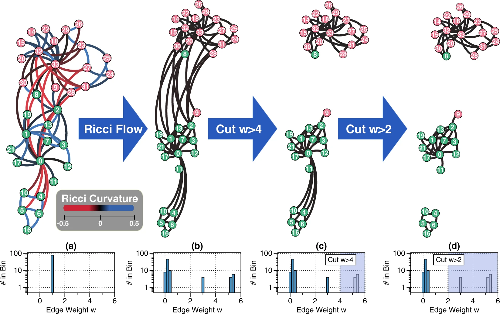

# Ollivier-Ricci-Flow-Experiments
Jupyter notebook for my experiments which examined Ollivier-Ricci flow (often just called Ricci flow if the context is clearly networks) for a
research project whilst I was at the University of Oxford. The project is presented in the style of a PNAS research article. 

My project received a distinction (grade 88/100), scored top of the class C5.4 Networks (which was taken by over 150 graduate-level Oxford mathematicians and computer scientists).

The PDF article and accopanying code can be found in this repository. 

Note: If I was to do this project again I would think about the data structures more carefully and would release the work as a Python package. As it happens, this was my first attempt to use Python outside the classroom for research purposes.

## Background Information

Ollivier-Ricci curvature (the metric) and Ollivier-Ricci flow (the community detection algorithm) were invented by Ni, Lin, Luo & Gao in 2019. Their work was highly acclaimed and was published in Nature (https://www.nature.com/articles/s41598-019-46380-9). 

Classical Ricci flow is a challenging domain of geometry, and its most famous application was in solving the Poincaré conjecture (one of the Millenium Problems) by Perelman. There is an entire book on the subject (https://arxiv.org/pdf/math/0607607.pdf). Essentially, Ricci flow smooths out ugly and irregular manifolds into smoother shapes, such as spheres, via some very complicated partial derivatives and their integrals. Here are two 20 second Youtube videos which demonstrate this in practice (https://www.youtube.com/watch?v=vvgJXECYars) and (https://www.youtube.com/watch?v=siAbBsj9XPk).

The method of Ricci flow by Ni et al is well-explained in my article from its first principles, which have origins in complex network geometry and optimal transport theory. Another good introduction to Ollivier-Ricci flow from the basics is by professor Gao (https://www.youtube.com/watch?v=703bwwcnRhI).

Here is a 1 min 30 secs demonstartion of Ollivier-Ricci flow on a network |(https://www.youtube.com/watch?v=QlENb_XlJ_8).

Here is a talk which includes extensions of Ricci flow to neural networks in machine learning (https://www.youtube.com/watch?v=jZWKicMwodA).

